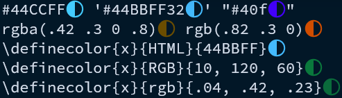

<!-- vim: set tabstop=2 shiftwidth=2: -->
<!-- markdownlint-disable -->
<br />
<div align="center">
  <h1>🎨 pigmentor.nvim</h1>
  <p>
    <strong>Your mentor for dealing with pigments (colors) in Neovim</strong>
  </p>
  <p>
    <a href="https://github.com/neovim/neovim/releases/tag/v0.9.0"></a>
    <a href="https://github.com/ImmanuelHaffner/pigmentor.nvim/blob/main/LICENSE"></a>
  </p>
</div>

**Pigmentor** is a Neovim plugin that intelligently highlights color values in your code with their actual colors. Whether you're working with CSS, LaTeX, or any code containing color values, Pigmentor visualizes them directly in your editor.

## ✨ Features

- 🎯 **Smart Color Detection**: Automatically finds and highlights various color formats
- 🎨 **Multiple Display Styles**: Choose between inline, highlight, or hybrid visualization modes
- 🔄 **Real-time Updates**: Colors update as you type and move your cursor
- 🎛️ **Mode-aware**: Different behavior for normal, insert, visual, and operator-pending modes
- 🖥️ **Window Management**: Smart handling of active/inactive windows
- ⚡ **Performance Optimized**: Only processes visible content for smooth editing

### Supported Color Formats

- **Hexadecimal**: `#FF0000`, `#F00`, `#FF0000AA`
- **CSS RGB/RGBA**: `rgb(255, 0, 0)`, `rgba(255, 0, 0, 0.5)`
- **LaTeX Colors**: `\definecolor{red}{RGB}{255,0,0}`, `\definecolor{blue}{HTML}{0000FF}`

### Examples


## 📦 Installation

Install using your favorite plugin manager:

### [lazy.nvim](https://github.com/folke/lazy.nvim)

```lua
{
  'ImmanuelHaffner/pigmentor.nvim',
  config = function()
    require'pigmentor'.setup{
      -- your configuration here
    }
  end,
}
```

### [packer.nvim](https://github.com/wbthomason/packer.nvim)

```lua
use {
  'ImmanuelHaffner/pigmentor.nvim',
  config = function()
    require'pigmentor'.setup{
      -- your configuration here
    }
  end
}
```

### [vim-plug](https://github.com/junegunn/vim-plug)

```vim
Plug 'ImmanuelHaffner/pigmentor.nvim'
```

The plugin supports auto-loading with default configuration via `plugin/pigmentor.lua`, requiring no additional setup for basic functionality.

## ⚙️ Configuration

Pigmentor comes with sensible defaults, but you can customize it to your needs:

### Default Configuration

```lua
require'pigmentor'.setup{
  enabled = true,                   -- whether the plugin is active
  display = {
    inactive = true,                -- show in inactive windows
    style = 'inline',               -- one of 'inline', 'highlight', 'hybrid'
    priority = 150,                 -- highlight priority, slightly above treesitter
    inline = {
      text_pre = nil,               -- text before color
      text_post = '●',              -- text after color (dot indicator)
    },
    highlight = {
      padding = {
        left = 1,                   -- padding spaces on the left
        right = 1,                  -- padding spaces on the right
      },
    },
  },
  modes = {
    n = {                           -- normal mode
      cursor = true,                -- show for item under cursor
      line = true,                  -- show for current line
      visible = true,               -- show for all visible lines
    },
    no = {                          -- operator-pending mode
      cursor = false,
      line = false,
      visible = false,
    },
    i = {                           -- insert mode
      cursor = false,
      line = false,
      visible = true,
    },
    [{ 'v', 'V', '\x16' }] = {      -- visual modes
      cursor = false,
      line = false,
      visible = false,
    },
  },
}
```

### Display Styles

#### Inline

Shows color indicators next to color values without replacing the text.


```lua
{
  display = {
    style = 'inline',
    inline = {
      text_post = '●',
    }
  }
}
```

You can use multiple characters.



```lua
{
  display = {
    style = 'inline',
    inline = {
      text_post = '',
    }
  }
}
```

You can place characters before the text.


```lua
{
  display = {
    style = 'inline',
    inline = {
      text_pre = '♦',
      text_post = nil,
    }
  }
}
```

You can provide a table of strings to `text_pre` and `text_post`.
The texts will be rendered consecutively with alternating inverting colors.
With `inverted` you configure whether to start with inverted colors.


```lua
{
  display = {
    style = 'inline',
    inline = {
      inverted = true,
      text_post = { '', '', },
    }
  }
}
```

#### Highlight

Replaces the color text background with the actual color.


```lua
{
  display = {
    style = 'highlight',
    highlight = {
      inverted = false,
      padding = {
        left = 0,
        right = 0,
      }
    }
  }
}

```

You can invert the colors.


```lua
{
  display = {
    style = 'highlight',
    highlight = {
      inverted = true,
      padding = {
        left = 1,
        right = 1,
      }
    }
  }
}
```


#### Hybrid

Combines both inline and highlight modes:


```lua
{
  display = {
    style = 'hybrid',
    inline = {
      text_pre = '♦',
      text_post = nil,
    },
    highlight = {
      inverted = false,
      padding = {
        left = 0,
        right = 0
      }
    }
  }
}
```


```lua
{
  display = {
    style = 'hybrid',
    inline = {
      text_pre = '',
      text_post = '',
    },
    highlight = {
      inverted = true,
      padding = {
        left = 1,
        right = 1
      }
    }
  }
}
```

## 🚀 Usage

Once installed and configured, Pigmentor works automatically.
You can also control it manually:

```lua
local pigmentor = require'pigmentor'

-- Toggle the plugin on/off
pigmentor.toggle()

-- Enable/disable explicitly
pigmentor.enable()
pigmentor.disable()

-- Cycle through display styles
pigmentor.cycle_display_style()

-- Refresh current buffer
pigmentor.refresh_buffer(vim.api.nvim_get_current_buf())

-- Refresh all visible buffers
pigmentor.refresh_visible_buffers()
```

### Keymaps

Add these to your configuration for convenient access:

```lua
local pm = require'pigmentor'
vim.keymap.set('n', '<leader>pt', pm.toggle, 
  { desc = 'Toggle color highlighting' })
vim.keymap.set('n', '<leader>pc', pm.cycle_display_style, 
  { desc = 'Cycle color display style' })
```

## 🎯 Mode Configuration

Pigmentor can behave differently in various Vim modes:

- **cursor**: Show colors for the item under the cursor
- **line**: Show colors for the entire current line
- **visible**: Show colors for all visible lines in the buffer

For example, you might want to see all colors while in normal mode, but only show colors for visible lines in insert mode to reduce distractions.

## 🔧 Advanced Configuration

### Custom Color Formats

While Pigmentor comes with built-in support for common color formats, you can examine `lua/pigmentor/colormatchers.lua` to understand how to extend it with custom patterns.

### Performance Tuning

For large files or when performance is a concern:

```lua
require'pigmentor'.setup{
  display = {
    inactive = false,  -- Don't highlight inactive windows
    priority = 100,    -- Tune extmark priority to not interfere with other extmarks
  },
  modes = {
    i = {
      visible = false, -- Disable in insert mode for performance
    },
  },
}
```

## 🤝 Contributing

Contributions are welcome! Please feel free to submit a Pull Request. For major changes, please open an issue first to discuss what you would like to change.

### Development

1. Fork the repository
2. Create your feature branch (`git checkout -b feature/amazing-feature`)
3. Commit your changes (`git commit -m 'Add some amazing feature'`)
4. Push to the branch (`git push origin feature/amazing-feature`)
5. Open a Pull Request

## 📝 License

This project is licensed under the MIT License - see the [LICENSE](LICENSE) file for details.

## 🙏 Acknowledgments

Thanks to the Neovim team for the excellent extmarks API.
 
 ### Inspiration and Alternatives
 
 - [color-picker.nvim](https://github.com/ziontee113/color-picker.nvim) -
   A powerful plugin that lets Neovim Users choose & modify colors.
   This plugin supports RGB, HSL and HEX colors.


 - [ccc.nvim](https://github.com/uga-rosa/ccc.nvim) -
   **C**reate **C**olor **C**ode in neovim.
   Use the colorful sliders to easily generate any desired color!


---

<div align="center">
  <sub>Built with ❤️ for the Neovim community</sub>
</div>
